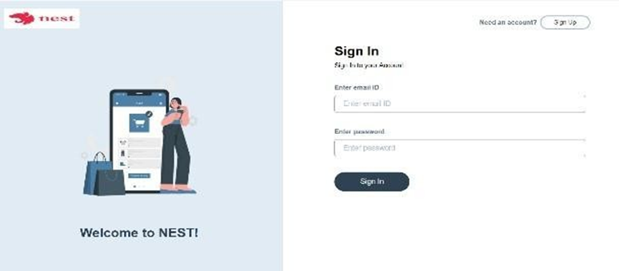
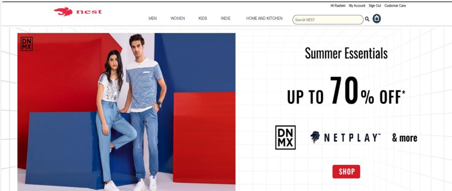
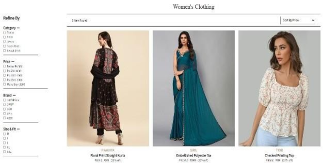
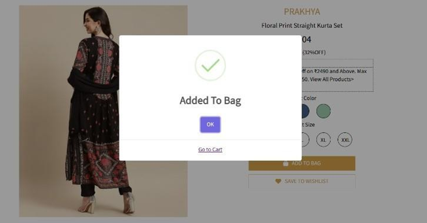
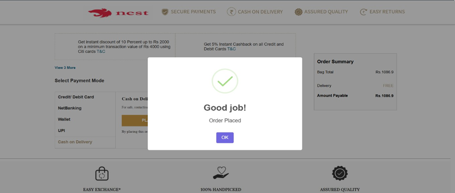

# NEST E_COMMERCE WEBSITE

A static e-commerce storefront built with HTML, CSS, and JavaScript. This project simulates a fashion and lifestyle shopping experience with product browsing, cart management, user authentication flow, and admin pages.

## ✅ Project Overview

`NEST E_COMMERCE WEBSITE` is a front-end website that provides:

- Home page with promotional sliders
- Product category navigation for men, women, electronics, and home/kitchen
- Cart and checkout flow
- User sign in / sign up experience
- Admin pages for dashboard, product management, and customer overview

## 🌟 Features

- Responsive user interface with hover-driven category navigation
- Search bar UI for searching products
- LocalStorage-based sign-in flow and cart persistence
- Product list and individual product detail views
- Cart page with item management
- Customer account page with order and address sections
- Admin pages to add/update products and view orders/customers
- Static image slider using Swiper styles

## 📷 Screenshots

Below are the screenshot files used to illustrate the website pages. Add these images to the repository and update the paths if needed.

<table>
  <tr>
    <td></td>
  </tr>
        <tr>
    <td></td>
  </tr>
  <tr>
    <td></td>
      </tr>
        <tr>
   <td></td>
  </tr>
  <tr>
    <td></td>
      </tr>
        <tr>
    <td></td>
  </tr>
  <tr>
    <td></td>
      </tr>
        <tr>
    <td></td>
  </tr>
  <tr>
    <td></td>
  </tr>
</table>

<br />
> Tip: Create a `screenshots/` folder in the repository and save these screenshots there, then reference them from this README.

## 📁 Project Structure

- `index.html` - Main landing page
- `productsPage.html` - Product listing page
- `women.html` - Women's category page
- `individual.html` - Individual product details page
- `cart.html` - Shopping cart page
- `myAccount.html` - User account page
- `order.html` - Order summary page
- `payment.html` - Payment page
- `signIn.html` / `signUp.html` - Authentication pages
- `Coustomer Care.html` - Customer support page
- `admin_dashboard.html` - Admin dashboard
- `admin_AddProduct.html` - Add product page for admin
- `admin_updateproduct.html` - Update product page for admin
- `admin_customer.html` - Admin customer overview
- `src/` - JavaScript source files for page logic
- `styles/` - CSS styles for each page
- `images/` - Image assets and logos

## 🛠️ Technology Stack

- HTML5
- CSS3
- JavaScript
- LocalStorage for simple state management
- Swiper CSS for carousel presentation

## ▶️ Run Locally

1. Clone the repository if you have not already:
   ```bash
   git clone https://github.com/rashmiSahooRanjan/NEST-E-COMMERCE-WEBSITE.git
   ```
2. Open the project folder in your browser or editor.
3. Open `index.html` in a web browser.

> For the best local development experience, use a live server extension or simple HTTP server because some browser features work more consistently over `http://`.

## 💡 Notes

- This project is a static front-end demo and does not include a back-end API.
- Product and user session data are managed locally in the browser using `localStorage`.
- Admin pages are present for demo purposes and rely on client-side logic.

## 📌 Credits

Built as a NEST e-commerce website demo using only front-end technologies.
